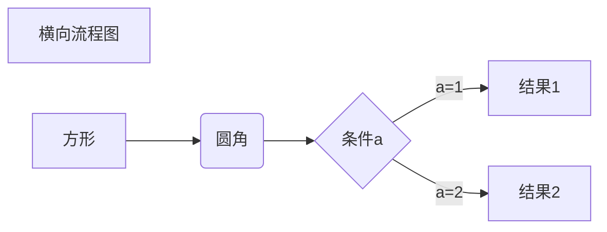
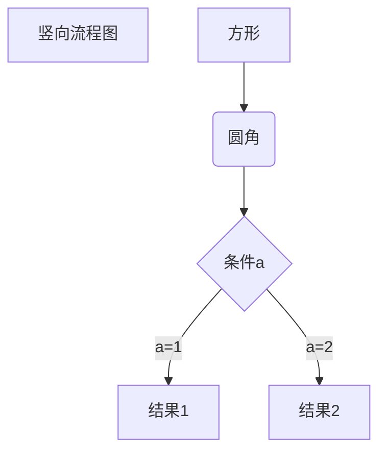
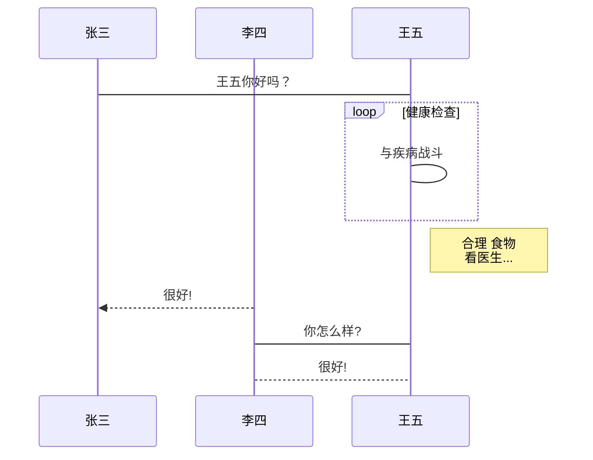
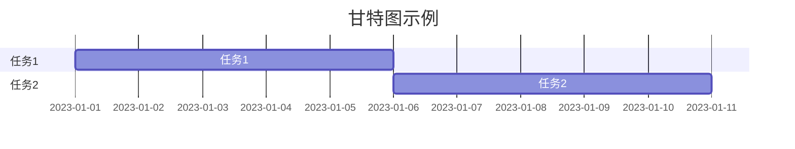
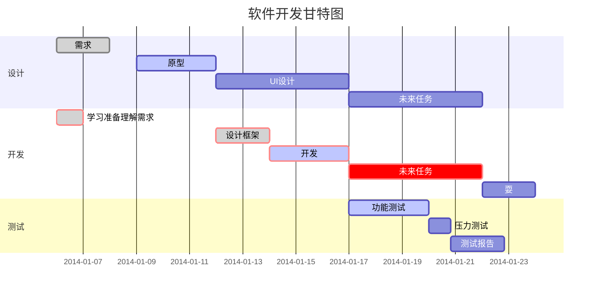

# Markdown

## Markdown 简介

Markdown 是一种轻量级标记语言，它允许人们使用易读易写的纯文本格式编写文档。

Markdown 语言在 2004 由约翰·格鲁伯（英语：John Gruber）创建。

Markdown 编写的文档可以导出 HTML 、Word、图像、PDF、Epub 等多种格式的文档。

Markdown 编写的文档后缀为 `.md`, `.markdown`。

## Markdown 编辑器

### VsCode

VScode 官网地址： https://code.visualstudio.com/

支持平台： Linux, macOS 以及 Windows


### Typora

Github 开源地址： https://github.com/typora

官网地址： http://typora.io/

支持平台： Linux, macOS 以及 Windows

### MarkText

Github 开源地址： https://github.com/marktext/marktext

官网地址： https://www.marktext.cc/

支持平台： Linux, macOS 以及 Windows


## Markdown 标题

Markdown 标题有两种格式。

1、使用 `=` 和 `-` 标记一级和二级标题

语法格式：

```
一级标题
========

二级标题
--------
```

2、使用 `#` 号标记 1-6 级标题

语法格式：

```
# 一级标题

## 二级标题

### 三级标题

#### 四级标题

##### 五级标题

###### 六级标题
```

## Markdown 段落

Markdown 段落仅有一种格式，段落的换行有两种方式：

1、使用两个以上的空格加回车。

语法格式：

```
这是段落1   
这是段落2
```


2、使用空行表示换行。

```
这是段落1

这是段落2
```

### 字体

Markdown 可以使用三种字体斜体、粗体、粗斜体。

语法格式：

```
*斜体文本*

_斜体文本_

**粗体文本**

__粗体文本__

***粗斜体文本***

___粗斜体文本___
```

### 分割线

你可以在一行中用三个以上的星号、减号、底线来建立一个分隔线，行内不能有其他东西。你也可以在星号或是减号中间插入空格。

语法格式：

```
***

* * *

*****

- - -

----------
```

### 删除线

如果段落上的文字要添加删除线，只需要在文字的两端加上两个波浪线 `~~` 即可。

语法格式：

```
~~删除的内容~~
```

### 下划线

原生的 Markdown 语法并不支持下划线，下划线可以通过 HTML 的 `<u>` 标签来实现。

语法格式：

```
<u>带下划线文本</u>
```

### 脚注

脚注是对文本的补充说明。

语法格式：

```
文本内容[^脚注标题]

[^脚注标题]: 脚注内容（注意：此处为英文冒号）
```

## Markdown 列表

Markdown 支持**有序列表**和**无序列表**。

无序列表有三种语法格式，分别使用星号（`*`）、加号（`+`）、减号（`-`）作为列表标记。后接空格，再接内容。

语法格式：

```
* 第一项
* 第二项
* 第三项

+ 第一项
+ 第二项
+ 第三项


- 第一项
- 第二项
- 第三项
```

有序列表使用数字并加上 `.` 号来表示。后接空格，再接内容。

语法格式：

```
1. 第一项
2. 第二项
3. 第三项
```

### 列表嵌套

列表嵌套只需在子列表中的选项前面添加两个或四个空格即可。

语法格式：

```
1. 第一项：
    - 第一项嵌套的第一个元素
    - 第一项嵌套的第二个元素
2. 第二项：
    - 第二项嵌套的第一个元素
    - 第二项嵌套的第二个元素
```

## Markdwon 区块

Markdown 区块引用是在段落开头使用 `>` 符号 ，然后紧跟一个空格符号。

语法格式：

```
> 区块引用
> Markdown Guide
> 学习 Markdown 相关知识
```

## Markdown 代码

### 单行代码

如果是单行代码，可以使用反引号（`）把它包起来。

语法格式：

```
`Hello Markdown!`
```

### 多行代码

如果是多行代码，有两种语法格式

1、使用 **4 个空格**或者一个**制表符（Tab键）** 表示一个代码区块。

语法格式：

```
    Hello
    Markdown
```

2、（**推荐使用**）使用 ``` 包裹一段代码，并指定一种语言（也可以不指定）。

## Markdown 链接

Markdwon 表示链接有两种语法。

1、给链接起一个别名（[我的博客](https://www.bbigsun.com/blog)）

语法格式：

```
[链接名称](链接地址)

## 示例

[我的博客](https://www.bbigsun.com/blog)
```

2、直接使用链接作为显示名称（<https://www.bbigsun.com/blog>）

语法格式：

```
<链接地址>

## 示例

<https://www.bbigsun.com/blog>
```

### 高级链接

通过变量来设置链接，变量在文章末尾赋值。


语法格式：

```
这个链接用 1 作为网址变量 [Google][1]
这个链接用 blog 作为网址变量 [Blog][blog]
然后在文档的结尾为变量赋值（网址）

[1]: http://www.google.com/
[blog]: http://www.bbigsun.com/
```

示例：

这个链接用 1 作为网址变量 [Google][1]
这个链接用 blog 作为网址变量 [Blog][blog]
然后在文档的结尾为变量赋值（网址）

[1]: http://www.bbigsun.com/
[blog]: http://www.bbigsun.com/blog


## Markdown 图片

在 Markdown 中使用图片有多种方式。

1、使用原生语法

语法格式：

```


```

示例：

```


```


 鼠标悬停会显示 BBigSun 


2、使用变量赋值

语法格式：

```
![img][url]

[url]: https://www.bbigsun.com/wp-content/uploads/2023/03/bbigsun.png
```

3、使用 HTML 的 `` 标签

Markdown 原生语法没有办法指定图片的高度与宽度，但是可以使用HTML的 `` 标签进行指定。

```

```

## Markdown 表格

Markdown 制作表格使用 `|` 来分隔不同的单元格，使用 `-` 来分隔表头和其他行。

在 Markdown 中表格的能力是非常鸡肋的，使用麻烦，且展示效果一般。如果涉及到复杂的表格，可以考虑用图片代替。

1、一个简单的 3*3 表格

语法格式：

```
|  表头   | 表头  | 表头  |
|  ----  | ----  | ---- |
| 单元格  | 单元格 | 单元格 |
| 单元格  | 单元格 | 单元格 |
```
示例：

|  表头   | 表头  | 表头  |
|  ----  | ----  | ---- |
| 单元格  | 单元格 | 单元格 |
| 单元格  | 单元格 | 单元格 |

2、设置表格格式

原生的 Markdwon 语法只能设置对齐方式

- `-:` 设置内容和标题栏居右对齐。
- `:-` 设置内容和标题栏居左对齐。
- `:-:` 设置内容和标题栏居中对齐。

其他格式需要借助 HTML 元素实现，比如：使用 `<br>` 标签进行单元格内换行。


## Markdown 高级技巧

Markdown 可以通过一些扩展或者增强工具，使用一些额外的语法。

### HTML 元素

Markdown 支持大量的 HTML 标签元素。

目前已知支持的 HTML 元素有：`<kbd>` `<b>` `<i>` `<em>` `<sup>` `<sub>` `<br>`等 。

示例：

使用 <kbd>Ctrl</kbd>+<kbd>Alt</kbd>+<kbd>Del</kbd> 重启电脑

```
使用 <kbd>Ctrl</kbd>+<kbd>Alt</kbd>+<kbd>Del</kbd> 重启电脑
```

### 转义

Markdown 使用了很多特殊符号来表示特定的意义，如果需要显示特定的符号则需要使用转义字符，Markdown 使用反斜杠转义特殊字符：

```
**文本加粗** 
\*\* 正常显示星号 \*\*
```

Markdown 支持以下这些符号前面加上反斜杠来帮助插入普通的符号：

```
\   反斜线
`   反引号
*   星号
_   下划线
{}  花括号
[]  方括号
()  小括号
#   井字号
+   加号
-   减号
.   英文句点
!   感叹号
```

### 公式

Markdown Preview Enhanced 使用 KaTeX 或者 MathJax 来渲染数学表达式。

KaTeX 拥有比 MathJax 更快的性能，但是它却少了很多 MathJax 拥有的特性。你可以查看 KaTeX supported functions/symbols 来了解 KaTeX 支持那些符号和函数。

默认下的分隔符：

- `$...$` 或者 `\(...\)` 中的数学表达式将会在行内显示。
- `$$...$$` 或者 `\[...\]` 或者 ```math 中的数学表达式将会在块内显示。

示例：

```
$$
f(x) = sin(x) + x
$$
```

$$
f(x) = sin(x) + x
$$


### 绘图

#### 流程图

1、横向流程图



2、竖向流程图



#### 标准流程图

1、竖向

```flow
st=>start: 开始框
op=>operation: 处理框
cond=>condition: 判断框(是或否?)
sub1=>subroutine: 子流程
io=>inputoutput: 输入输出框
e=>end: 结束框

st->op->cond
cond(yes)->io->e
cond(no)->sub1(right)->op
```

2、横向

```flow
st=>start: 开始框
op=>operation: 处理框
cond=>condition: 判断框(是或否?)
sub1=>subroutine: 子流程
io=>inputoutput: 输入输出框
e=>end: 结束框

st(right)->op(right)->cond
cond(yes)->io(bottom)->e
cond(no)->sub1(right)->op
```

#### UML时序图

1、简单使用

```sequence
对象A->对象B: 对象B你好吗?（请求）
Note right of 对象B: 对象B的描述
Note left of 对象A: 对象A的描述(提示)

对象B-->对象A: 我很好(响应)
对象A->对象B: 你真的好吗？
```

2、复杂使用

```sequence
Title: 标题：复杂使用

对象A->对象B: 对象B你好吗?（请求）
Note right of 对象B: 对象B的描述
Note left of 对象A: 对象A的描述(提示)

对象B-->对象A: 我很好(响应)
对象B->小三: 你好吗
小三-->>对象A: 对象B找我了
对象A->对象B: 你真的好吗？
Note over 小三,对象B: 我们是朋友

participant C
Note right of C: 没人陪我玩
```

#### UML标准时序图



#### 甘特图

1、简单使用



2、复杂使用


